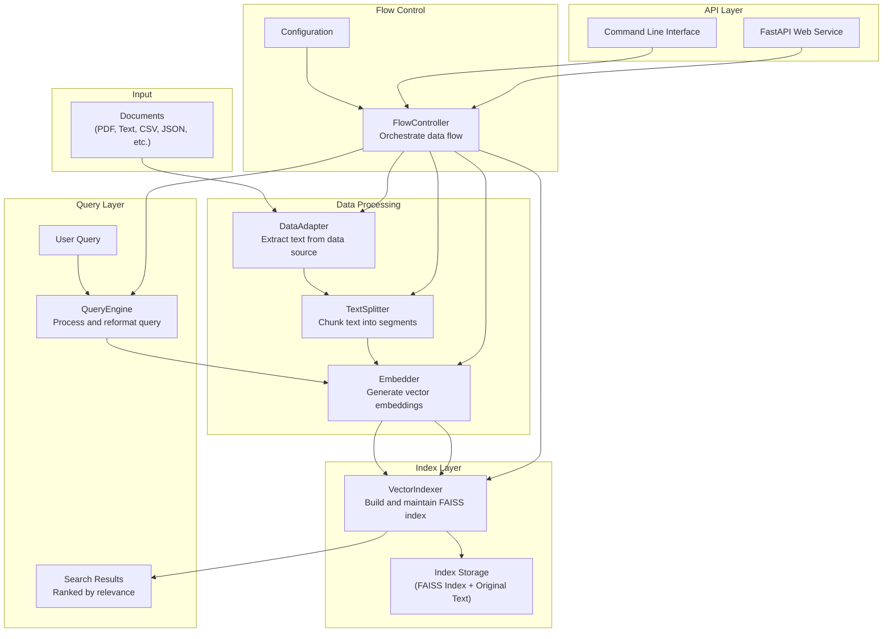

# TinySearch

**A lightweight vector search and retrieval system for document understanding, semantic search, and text information retrieval.**

TinySearch provides an end-to-end solution for converting documents into searchable vector embeddings, with a focus on simplicity, flexibility, and efficiency. Perfect for building RAG (Retrieval-Augmented Generation) systems, semantic document search, knowledge bases, and more.

## Key Features

- 🧩 **Modular Design**: Plug-and-play components for data processing, text splitting, embedding generation, and vector retrieval
- 🔍 **Semantic Search**: Find contextually relevant information beyond keyword matching
- ⚙️ **Highly Configurable**: Simple YAML configuration to control all aspects of the system
- 🔌 **Multiple Input Formats**: Support for TXT, PDF, CSV, Markdown, JSON, and custom adapters
- 🤖 **Embedding Models**: Integration with HuggingFace models like Qwen-Embedding and more
- 🚀 **Fast Search**: FAISS vector indexing with configurable metrics and index types
- 💾 **Incremental Updates**: Add new documents without rebuilding the entire index
- 🔄 **Hot-Update**: Real-time index updates when source documents change
- 🌐 **API Interface**: FastAPI endpoint for easy integration with other services
- 🔐 **API Security**: Authentication with API keys and rate limiting protection
- 🧠 **Context Management**: Optimize content for LLM processing with token counting and window sizing
- 📊 **Response Formatting**: Format results in multiple formats (Text, Markdown, JSON, HTML)
- 🛡️ **Data Validation**: Comprehensive utilities for ensuring data integrity
- 🖥️ **Web UI**: Simple web interface for search and index management
- 🧪 **Extensible**: Easy to add new components or customize existing ones

## System Architecture



## Documentation

TinySearch includes comprehensive documentation to help you get started quickly and make the most of its features:

- **[📘 User Guide](docs/user_guide.md)** ([中文](docs/user_guide_CN.md))**
  - Installation instructions
  - Core concepts
  - Configuration overview
  - CLI usage examples
  - API integration
  - Advanced features & patterns
  - Troubleshooting common issues

- **[🧰 API Reference](docs/api_reference.md)** ([中文](docs/api_reference_CN.md))**
  - Component interfaces
  - Method signatures
  - Parameter descriptions
  - Return types
  - Usage examples
  - Extension patterns

- **[🏗️ Architecture Documentation](docs/architecture.md)** ([中文](docs/architecture_CN.md))**
  - System design overview
  - Component descriptions
  - Data flow diagrams
  - Extension points
  - Design decisions

- **[⚙️ Configuration Guide](docs/configuration.md)** ([中文](docs/configuration_CN.md))**
  - Configuration schema
  - Advanced options
  - Performance tuning
  - Component-specific settings
  - Configuration examples

- **[✨ Feature Summary](docs/feature_summary.md)** ([中文](docs/feature_summary_CN.md))**
  - Data validation utilities
  - Context window management
  - Response formatting utilities
  - Hot-update capabilities
  - Usage examples

## API

TinySearch provides a RESTful API for integrating with other applications:

```python
# Query the index
import requests
response = requests.post(
    "http://localhost:8000/query",
    headers={"X-API-Key": "your-api-key"},
    json={"query": "Your search query", "top_k": 5}
)
results = response.json()
```

API features include:
- Full text search with vector embeddings
- Index management (build, upload, stats, clear)
- Authentication with API keys
- Rate limiting protection
- Web UI for easy exploration

For API documentation, see [API Guide](docs/api.md) and [API Authentication Guide](docs/api_authentication.md) ([中文](docs/api_authentication_CN.md)).

## Installation

```bash
# Basic installation
pip install tinysearch

# With API support
pip install tinysearch[api]

# With embedding models support
pip install tinysearch[embedders]

# With all adapters
pip install tinysearch[adapters]

# With all features
pip install tinysearch[full]
```

## Quick Start

### 1. Create a configuration file

Create a `config.yaml` file:

```yaml
adapter:
  type: text
  params:
    encoding: utf-8

splitter:
  type: character
  chunk_size: 300
  chunk_overlap: 50

embedder:
  type: huggingface
  model: Qwen/Qwen-Embedding
  device: cuda  # or cpu
  normalize: true

indexer:
  type: faiss
  index_path: index.faiss
  metric: cosine
  
query_engine:
  method: template
  template: "Please find information about: {query}"
  top_k: 5
```

### 2. Build an index

```bash
tinysearch index --data ./your_documents --config config.yaml
```

### 3. Query the index

```bash
tinysearch query --q "Your search query" --config config.yaml
```

### 4. Start the API server with web UI

```bash
tinysearch-api
```

Then visit http://localhost:8000 in your browser to use the web interface, or send API requests programmatically:

```bash
curl -X POST http://localhost:8000/query -H "Content-Type: application/json" -d '{"query": "Your search query", "top_k": 5}'
```

## Examples

TinySearch includes various example scripts in the `examples/` directory to demonstrate different features:

### Basic Examples
- **simple_example.py**: Basic usage of TinySearch
- **flow_example.py**: Demonstrates the flow controller
- **faiss_gpu_demo.py**: Shows how to use GPU acceleration with FAISS
- **api_auth_demo.py**: Demonstrates API authentication
- **web_ui_demo.py**: Shows how to use the web UI

### Advanced Features Demo

The `advanced_features_demo.py` script showcases the full capabilities of TinySearch with maximum customization:

#### Features Demonstrated

1. **Data Validation Utilities**
   - Path validation
   - File extension validation
   - Configuration validation
   - Embedding dimension validation

2. **Context Window Management**
   - Token counting
   - Window sizing
   - Context generation for queries

3. **Response Formatting**
   - Plain text formatting
   - Markdown formatting
   - JSON formatting
   - HTML formatting
   - Custom formatting with term highlighting

4. **Hot-Update Capabilities**
   - Real-time monitoring of document changes
   - Automatic index updates
   - Custom update callbacks

5. **Custom Components**
   - Multi-format data adapter
   - Custom response formatter
   - Custom reranking function

#### Running the Demo

```bash
cd /path/to/TinySearch
python examples/advanced_features_demo.py
```

The demo requires additional dependencies:

```bash
pip install torch sentence-transformers faiss-cpu watchdog
```

## Use Cases

- 🔎 **Semantic document search**: Find contextually relevant information beyond simple keyword matching
- 📚 **Knowledge base retrieval**: Build intelligent Q&A systems based on your documents
- 🤖 **RAG systems**: Enhance LLM outputs with relevant document context
- 📊 **Recommendation systems**: Find similar items based on their content
- 🧠 **Content organization**: Automatically categorize and group related documents

## Features of the Web UI

The TinySearch Web UI provides an intuitive interface for interacting with the system:

- **Search Interface**: Easily search through your documents with customizable parameters
- **Index Management**: Upload documents, build indexes, and manage your data
- **Statistics Dashboard**: View insights about your index and processed documents
- **Authentication Management**: Manage API keys and security settings

## Custom Data Adapters

You can create custom data adapters by implementing the `DataAdapter` interface:

```python
from tinysearch.base import DataAdapter

class MyAdapter(DataAdapter):
    def extract(self, filepath):
        # Your code to extract text from the file
        return [text1, text2, ...]
```

Then configure it in your `config.yaml`:

```yaml
adapter:
  type: custom
  params:
    module: my_module
    class: MyAdapter
    init:
      param1: value1
```

## Development

To set up the development environment:

```bash
# Clone the repository
git clone https://github.com/yourusername/tinysearch.git
cd tinysearch

# Install development dependencies
pip install -e ".[dev]"

# Run tests
pytest
```

## License

This project is licensed under the MIT License - see the LICENSE file for details.

## Keywords

vector search, semantic search, document retrieval, embeddings, FAISS, RAG, information retrieval, text search, vector database, document understanding, NLP, natural language processing, AI search