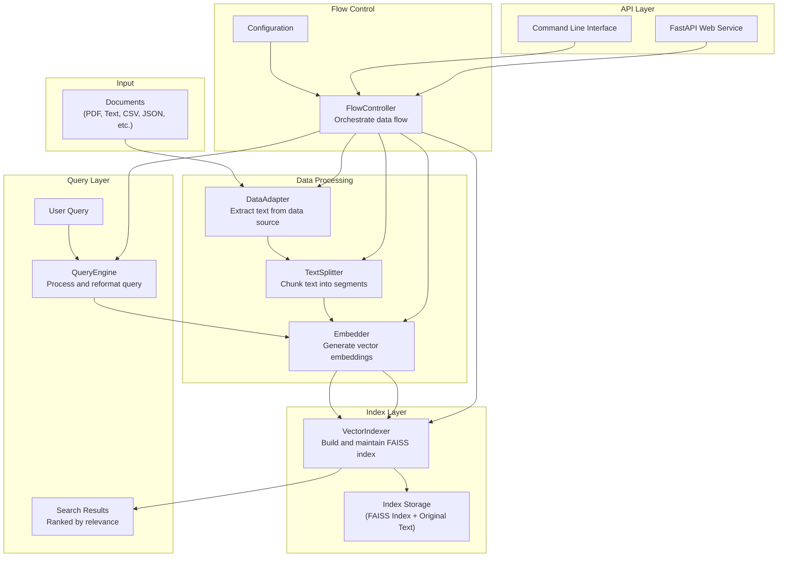

# TinySearch Architecture

This document describes the architecture of TinySearch, a lightweight vector retrieval system designed for embedding, indexing, and searching text data.

## Overview

TinySearch follows a modular design pattern, with clear separation of concerns between components. Each component has a well-defined interface, making the system highly extensible. The architecture enables a pipeline approach to text processing, from data ingestion to query response.

## System Diagram



## Core Components

### DataAdapter

DataAdapter is responsible for extracting text from different file formats. It defines a simple interface:

```python
def extract(self, filepath: Union[str, Path]) -> List[str]
```

Different implementations handle various file formats:
- **TextAdapter**: Plain text files
- **PDFAdapter**: PDF documents
- **CSVAdapter**: CSV files with text columns
- **MarkdownAdapter**: Markdown documents
- **JSONAdapter**: JSON files with text fields

Custom adapters can be implemented to support additional data sources.

### TextSplitter

TextSplitter chunks text into smaller segments suitable for embedding. It handles:
- Breaking text into appropriately sized chunks
- Maintaining overlap between chunks for context preservation
- Preserving metadata association with text chunks

The primary implementation is `CharacterTextSplitter` which splits text based on character count and optional separators.

### Embedder

Embedder converts text chunks into vector embeddings using machine learning models. The main implementation is `HuggingFaceEmbedder`, which:
- Supports various embedding models from Hugging Face
- Provides GPU acceleration when available
- Handles batching for efficient processing
- Supports embedding normalization
- Manages embedding cache to avoid redundant computation

### VectorIndexer

VectorIndexer builds and maintains the vector search index. The primary implementation is `FAISSIndexer`, which:
- Creates efficient vector indices using Facebook AI Similarity Search (FAISS)
- Supports multiple index types (Flat, IVF, HNSW)
- Enables various similarity metrics (cosine, L2, inner product)
- Provides persistent storage of indices
- Manages the association between vectors and original text chunks

### QueryEngine

QueryEngine processes user queries and retrieves relevant results. The `TemplateQueryEngine` implementation:
- Formats raw queries using templates
- Converts queries to embeddings
- Searches the vector index for similar chunks
- Supports optional reranking of results

### FlowController

FlowController orchestrates the entire data processing pipeline:
- Coordinates the flow of data between components
- Manages configuration across the system
- Implements caching for better performance
- Handles incremental updates to the index
- Provides consistent interface for building indices and querying

## Data Flow

### Indexing Flow

1. **Data Extraction**:
   - DataAdapter reads source documents
   - Text is extracted from various file formats

2. **Text Chunking**:
   - TextSplitter breaks text into manageable chunks
   - Metadata is associated with each chunk

3. **Embedding Generation**:
   - Embedder converts text chunks to vectors
   - Vectors are normalized if configured

4. **Index Building**:
   - VectorIndexer adds vectors to the index
   - Text chunks are stored for retrieval

5. **Storage**:
   - Index is saved to disk for persistence
   - Cached data is maintained for performance

### Query Flow

1. **Query Processing**:
   - User query is received via CLI or API
   - QueryEngine formats the query using templates

2. **Query Embedding**:
   - Formatted query is converted to vector
   - Same embedding model is used as for indexing

3. **Vector Search**:
   - Index is searched for similar vectors
   - Top-K results are retrieved

4. **Result Formatting**:
   - Results are ranked by similarity
   - Text and metadata are returned

## Configuration System

TinySearch uses a flexible configuration system:
- YAML-based configuration files
- Component-specific configurations
- Runtime configuration overrides
- Default configurations for quick start

## Extension Points

TinySearch is designed to be extensible:
1. **Custom DataAdapters**: Add support for new file formats
2. **Custom TextSplitters**: Implement domain-specific splitting logic
3. **Custom Embedders**: Integrate alternative embedding models
4. **Custom VectorIndexers**: Use different vector search technologies
5. **Custom QueryEngines**: Implement specialized query processing

## Performance Considerations

### Caching

The FlowController implements caching to improve performance:
- Document processing results are cached
- Processed files are tracked to avoid redundant work
- Cache can be cleared or bypassed when needed

### Batching

Embedding generation supports batching for improved throughput:
- Configurable batch size
- Progress reporting for long-running operations

### Index Optimization

FAISS indexer provides performance options:
- Different index types for speed vs. accuracy tradeoffs
- GPU acceleration when available
- Index persistence for quick startup

## Future Architecture Enhancements

1. **Distributed Processing**: Support for distributed document processing
2. **Advanced Reranking**: Post-processing of search results for improved accuracy
3. **Hybrid Search**: Combining vector search with keyword-based approaches
4. **Streaming Updates**: Real-time index updates for dynamic content
5. **Filtering**: Metadata-based filtering of search results 