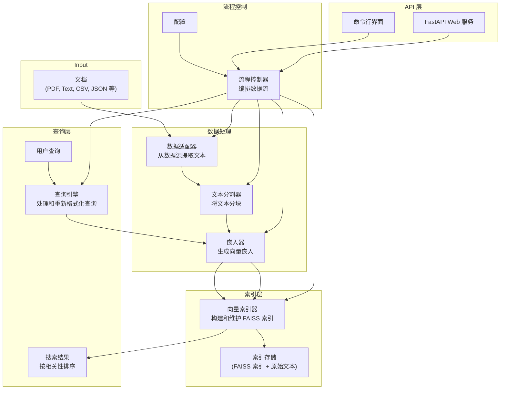

# TinySearch 架构

本文档描述了 TinySearch 的架构，TinySearch 是一个轻量级向量检索系统，专为文本数据的嵌入、索引和搜索而设计。

## 概述

TinySearch 遵循模块化设计模式，组件之间职责明确分离。每个组件都有明确定义的接口，使系统具有高度可扩展性。该架构采用管道方式处理文本，从数据摄取到查询响应。

## 系统图



## 核心组件

### DataAdapter（数据适配器）

DataAdapter 负责从不同文件格式中提取文本。它定义了一个简单的接口：

```python
def extract(self, filepath: Union[str, Path]) -> List[str]
```

不同的实现处理各种文件格式：
- **TextAdapter**：纯文本文件
- **PDFAdapter**：PDF 文档
- **CSVAdapter**：带有文本列的 CSV 文件
- **MarkdownAdapter**：Markdown 文档
- **JSONAdapter**：带有文本字段的 JSON 文件

可以实现自定义适配器以支持更多数据源。

### TextSplitter（文本分割器）

TextSplitter 将文本分成适合嵌入的较小段落。它处理：
- 将文本分割成适当大小的块
- 在块之间保持重叠以保留上下文
- 保留文本块与元数据的关联

主要实现是 `CharacterTextSplitter`，它基于字符计数和可选分隔符分割文本。

### Embedder（嵌入器）

Embedder 使用机器学习模型将文本块转换为向量嵌入。主要实现为 `HuggingFaceEmbedder`，其特点包括：
- 支持来自 Hugging Face 的多种嵌入模型
- 在可用时提供 GPU 加速
- 支持高效的批量处理
- 支持嵌入向量归一化
- 管理嵌入缓存以避免重复计算
- **在 CPU 下支持 bf16（bfloat16）推理，如不支持会自动回退到 float32 并给出提示**

### VectorIndexer（向量索引器）

VectorIndexer 构建和维护向量搜索索引。主要实现是 `FAISSIndexer`，它：
- 使用 Facebook AI Similarity Search (FAISS) 创建高效的向量索引
- 支持多种索引类型（Flat、IVF、HNSW）
- 启用各种相似度度量（余弦、L2、内积）
- 提供索引的持久化存储
- 管理向量与原始文本块之间的关联

### QueryEngine（查询引擎）

QueryEngine 处理用户查询并检索相关结果。`TemplateQueryEngine` 实现：
- 使用模板格式化原始查询
- 将查询转换为嵌入向量
- 在向量索引中搜索相似的块
- 支持可选的结果重排序

### FlowController（流程控制器）

FlowController 编排整个数据处理流水线：
- 协调组件之间的数据流
- 管理整个系统的配置
- 实现缓存以提高性能
- 处理索引的增量更新
- 为构建索引和查询提供一致的接口

## 数据流

### 索引流程

1. **数据提取**：
   - DataAdapter 读取源文档
   - 从各种文件格式中提取文本

2. **文本分块**：
   - TextSplitter 将文本分成可管理的块
   - 每个块关联元数据

3. **嵌入生成**：
   - Embedder 将文本块转换为向量
   - 如果配置了，向量会被归一化

4. **索引构建**：
   - VectorIndexer 将向量添加到索引中
   - 存储文本块以便检索

5. **存储**：
   - 将索引保存到磁盘以持久化
   - 维护缓存数据以提高性能

### 查询流程

1. **查询处理**：
   - 通过 CLI 或 API 接收用户查询
   - QueryEngine 使用模板格式化查询

2. **查询嵌入**：
   - 将格式化查询转换为向量
   - 使用与索引相同的嵌入模型

3. **向量搜索**：
   - 在索引中搜索相似向量
   - 检索 Top-K 结果

4. **结果格式化**：
   - 按相似度排序结果
   - 返回文本和元数据

## 配置系统

TinySearch 使用灵活的配置系统：
- 基于 YAML 的配置文件
- 组件特定的配置
- 运行时配置覆盖
- 用于快速启动的默认配置

## 扩展点

TinySearch 设计为可扩展的：
1. **自定义 DataAdapters**：添加对新文件格式的支持
2. **自定义 TextSplitters**：实现领域特定的分割逻辑
3. **自定义 Embedders**：集成替代嵌入模型
4. **自定义 VectorIndexers**：使用不同的向量搜索技术
5. **自定义 QueryEngines**：实现专门的查询处理

## 性能考虑

### 缓存

FlowController 实现缓存以提高性能：
- 缓存文档处理结果
- 跟踪已处理文件以避免重复工作
- 可以在需要时清除或绕过缓存

### 批处理

嵌入生成支持批处理以提高吞吐量：
- 可配置的批大小
- 长时间运行操作的进度报告

### 索引优化

FAISS 索引器提供性能选项：
- 不同索引类型以在速度与准确性之间做出权衡
- 在可用时使用 GPU 加速
- 索引持久化以快速启动

## 未来架构增强

1. **分布式处理**：支持分布式文档处理
2. **高级重排序**：搜索结果的后处理以提高准确性
3. **混合搜索**：结合向量搜索和基于关键字的方法
4. **流式更新**：对动态内容的实时索引更新
5. **过滤**：基于元数据的搜索结果过滤 